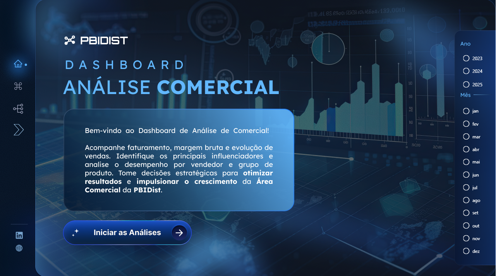
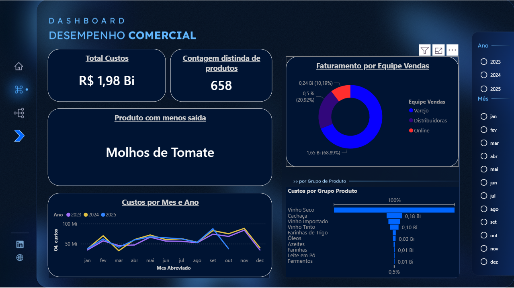

# Análise de Custo

Projeto de dashboard desenvolvido a partir de um **intensivão**, com aprimoramentos próprios e inclusão de **insights adicionais**.

O objetivo foi praticar análise de dados, visualização e interpretação de informações, simulando um cenário real de negócio.

## Objetivos
- Analisar a evolução dos custos ao longo do tempo
- Comparar resultados por mês e ano
- Identificar categorias com maior impacto nos gastos
- Explorar insights além da análise proposta originalmente

## Ferramentas Utilizadas
- Power BI
- Excel

## Dashboard

### Home

### Dashboard

## Principais Influeniadores

### Meu Insights

## Observações
Este projeto foi desenvolvido com base em um **conteúdo educacional**, sendo adaptado e expandido com análises próprias para fins de aprendizado e portfólio.

O arquivo **.pbix não está disponível neste repositório** devido ao tamanho do arquivo, mas pode ser apresentado mediante solicitação.
